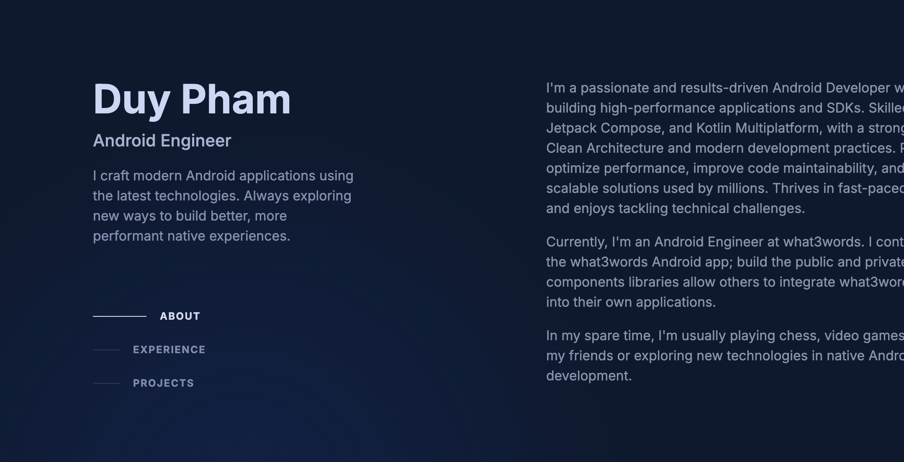

# Helios Portfolio & Payment Server

A versatile Ktor web server that hosts a comprehensive personal portfolio, a downloadable resume, and a streamlined payment QR code system. This project is designed to be a central hub for your professional identity and a convenient tool for receiving payments.

## ✨ Features

- **Portfolio Showcase**: Dynamic, data-driven content rendering from a JSON configuration. Easily update your profile, experience, and projects without touching the code.
- **Resume Hosting**: Serves your latest CV/Resume as a downloadable PDF (`/resume`).
- **Payment QR Server**: Clean, responsive interface (`/payment`) for displaying payment QR codes. Simply share the link, and users can scan or tap to pay.
- **Responsive Design**: Optimized layout for various screen sizes using Tailwind CSS.
- **Docker Support**: Containerized for easy deployment anywhere.

## 🛠️ Tech Stack

- **[Kotlin](https://github.com/JetBrains/kotlin)**: Modern, concise programming language.
- **[Ktor](https://github.com/ktorio/ktor)**: Lightweight web framework for Kotlin.
- **[FreeMarker](https://ktor.io/docs/server-freemarker.html)**: Template engine for dynamic content.
- **[Tailwind CSS](https://tailwindcss.com/)**: Utility-first CSS framework for styling.
- **[Docker](https://www.docker.com/)**: Platform for developing, shipping, and running applications.

## 🚀 Getting Started

### Prerequisites

- Java 11 or higher
- Gradle (included in wrapper)
- Docker (optional, for containerized run)

### Installation

1.  Clone the repository.

2.  **Configuration**:
    -   Update `portfolio-config.json` in the root directory (or configured storage path) to customize your profile and content.
    -   Place your Resume PDF in the configured storage directory (default: `storage/cv/DuyPham_CV.pdf`).

3.  **Payment Images**:
    -   Navigate to `src/main/resources/static/images/payment/`
    -   Replace existing QR images (e.g., `mb_bank_qr_code.jpg`, `momo_qr_code.jpg`) with your own.

### Running the Server

**Using Gradle:**
```bash
./gradlew run
```

**Using Docker:**
```bash
docker-compose up --build
```

Access the application:
-   **Portfolio**: [http://localhost:2502/](http://localhost:2502/)
-   **Payment**: [http://localhost:2502/payment](http://localhost:2502/payment)
-   **Resume**: [http://localhost:2502/resume](http://localhost:2502/resume)

*Note: Default SSL port is 2502 (configurable in `application.conf`).*

## 📱 Screenshots

### Desktop View


*(Add screenshots for Payment View if available)*

## 🔧 Configuration

### Server Configuration
To change the host, port, or SSL settings, modify `src/main/resources/application.conf`:

```hocon
ktor {
    deployment {
        sslPort = 2502
    }
    security {
        ssl {
            keyStore = helios_portfolio.jks
            keyAlias = heliosAlias
            keyStorePassword = helios123
            privateKeyPassword = helios123
        }
    }
}

storage {
    cv {
        directory = "storage/cv"
    }
}
```

### Content Configuration
The portfolio content is driven by `portfolio-config.json`. You can modify this file to update:
-   Profile Information (Name, Title, Social Links)
-   About Section
-   Work Experience
-   Projects

## Deployment
The server is hosted on my [Raspberry Pi 5](https://www.raspberrypi.com/products/raspberry-pi-5/) and deployed at https://phpduy.info, thanks to [Cloudflare Tunnel](https://www.cloudflare.com/en-gb/products/tunnel/).

## 📄 License

This project is licensed under the MIT License.
